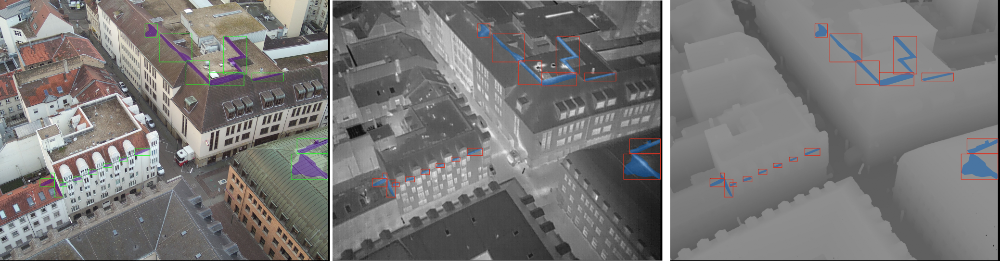

# AI HERO 2 Challenge Use Case Energy

This is the complete source code for the AI HERO Hackathon 2 (2023) for the Use Case Energy. The task is to segment thermal bridge instances, i.e. weak points in building envelopes that leak thermal energy, in fly-over drone images.

[](https://www.python.org/downloads/) [](https://opensource.org/licenses/BSD-2-Clause)

## Table of Contents

<!--ts-->
   * [Data](#data)
   * [Structure of the Skeleton Code](#structure-of-the-skeleton-code)
   * [HOREKA Setup](#horeka-setup)
     * [Clone from Github](#clone-the-skeleton-code)
     * [Virtual Environment](#creating-a-virtual-environment)
   * [Training on HOREKA](#training-on-horeka)
   * [Monitoring Jobs](#useful-commands-for-job-monitoring)
   * [Inference](#inference)
<!--te-->

## Data

The train data is available in the following workspace on the cluster:

```
/hkfs/work/workspace/scratch/ih5525-energy-train-data
```

It consists of a set of images of building rooftops. Each image has five channels, i.e. three RGB color channels, a thermal channel and a depth map. An example is displayed below:



Each image has the shape $(width=2680, height=3370, channels=5)$ and all values are encoded as 8-bit integers in the value range $[0,255]$. The baseline code splits the data in two fractions for training and test purposes with a fraction of 80:20. However, you are free to split the data as you like. The directory structure is as follows:

```
.
├── descriptor.json
├── DJI_0002_R.npy
├── DJI_0003_R.npy
├── ...
├── DJI_0997_R.npy
└── DJI_0998_R.npy
```

Each of the `*.npy` files contains and image, while the `descriptor.json` contains the annotation for all images in COCO JSON format. You may want to use the following precomputed mean and standard deviation values useful for normalization:

$$\mu = [130.0, 135.0, 135.0, 118.0, 118.0]$$

$$\sigma = [44.0, 40.0, 40.0, 30.0, 21.0]$$

## Structure of the Skeleton Code

The baseline implements a binary instance segmentation approach. A Mask R-CNN is trained to identify thermal bridges entities. The content of the different files is as follows:

- **download.py** - Fetches public *and* benchmark data including annotations from Zenodo
- **preprocess.py** - Decompresses and renames the data. Creates two separate directories for contest and benchmark data
- **dataset.py** - Implements the PyTorch dataset class for the drone images, reads npy data-files and draw segmentation masks
- **model.py** - Implements a Mask R-CNN
- **train.py** - Trains a model with passed hyperparameters and data root path
- **predict.py** - Performs a prediction with given model with passed hyperparameters and data root path
- **metric.py** - Contains the target metric - Jaccard Index (also: Intersection-over-Union or IoU)

Additionally, bash scripts for running the training, inference and evaluation are available.

## HoreKa Setup

The HoreKa cluster is organized in workspaces. Each group got its own workspace assigned that is named after your group ID (e.g. H1). In this workspace you will develop your code, create your virtual environment, save models and preprocessed versions of data and so on. Once you're logged in to HoreKa, your first step is going to your group workspace. For the following steps please substitute `<YOUR_GROUP_NAME>` by your group ID.

```
cd /hkfs/work/workspace/scratch/ih5525-<YOUR_GROUP_NAME>
```

### Clone the Skeleton Code

Clone this repository to your workspace. 

```
cd /hkfs/work/workspace/scratch/ih5525-<YOUR_GROUP_NAME>
git clone https://github.com/AI-HERO-2-Energy.git
```

### Setting up your Environment

Follow the instructions to create a virtual environment. Optionally, you can install the requirements.txt from this repo if you want to build on it. You can choose the python version by simply adapting ```python3.9``` to your desired version.

#### Go to your Workspace

```
cd /hkfs/work/workspace/scratch/ih5525-<YOUR_GROUP_NAME>
```

### Creating a Virtual Environment

Using the `module` command, we will first load some standard software modules.

```
module load compiler/gnu/11
module load mpi/openmpi/4.0
module load lib/hdf5/1.12
module load devel/cuda/11.8
```

Afterwards we can create a Python virtual environment.

```
python3.9 -m venv energy_env
source energy_env/bin/activate
pip install -U pip
pip install -r /hkfs/work/workspace/scratch/ih5525-<YOUR_GROUP_NAME>/AI-HERO-2-Energy/requirements.txt
```

## Training on HOREKA

Submitting to HOREKA is done via the `sbatch` command. It requires a bash script that will be executed on the nodes. You can find the bash script that starts training the baseline model in this repository (`train.sh`).  In the script you also see the defined sbatch flags. For GPU nodes use `--partition=accelerated`. If you only need a CPU for a certain job, you can submit to `--partition=cpuonly`. You can adapt all other flags if you want. Find more information about `sbatch` here: https://slurm.schedmd.com/sbatch.html.

In the script you need to adapt the path to your group workspace in lines 11 and 16. Then submit your job via:

```
sbatch train.sh
```

## Useful Commands for Job Monitoring

List your active jobs and check their status, time and nodes:

```
squeue
```

A more extensive list of all your jobs in a specified time frame, including the consumed energy per job:

```
sacct --format User,Account,JobID,JobName,ConsumedEnergy,NodeList,Elapsed,State -S 2023-06-1908:00:00 -E 2023-06-2116:00:00
```

Print the sum of your overall consumed energy (fill in your user ID):

```
sacct -X -o ConsumedEnergy --starttime 2023-05-2508:00:00 --endtime 2023-06-2116:00:00 --user <YOUR USER ID> |awk '{sum+=$1} END {print sum}'
```

Open a new bash shell on the node your job is running on and use regular Linux commands for monitoring:

```
srun --jobid <YOUR JOB ID> --overlap --pty /bin/bash
htop
watch -n 0.1 nvidia-smi
exit  # return to the regular HOREKA environment
```

Cancel / kill a job:
   
```
scancel <YOUR JOB ID>
```

Find more information here: https://www.nhr.kit.edu/userdocs/horeka/batch/

## Inference

Once the instance segmentation model is trained the final segmentation is assessed using `predict.py`. For this, we will run your modified version on a held-out test set to obtain your final predictions. Therefore, make sure to properly adapt the predict script to whatever segmentation method you are using.

Adapt the paths to your group workspace and run it via:

```
sbatch predict.py
```
